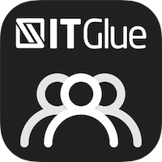
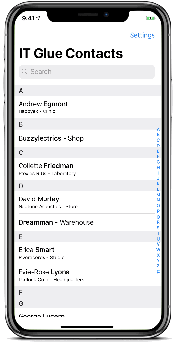
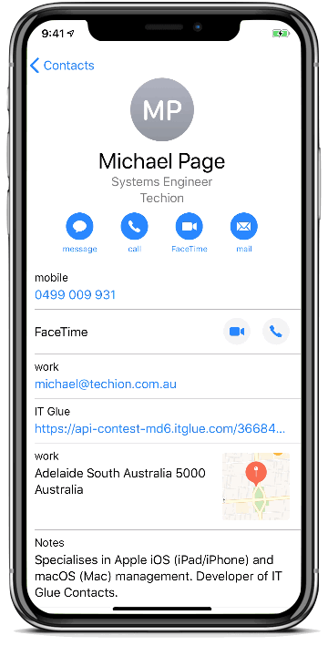
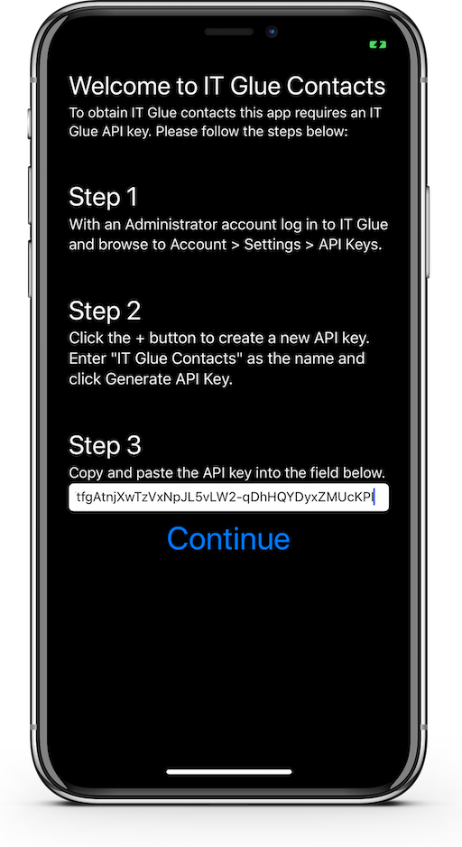
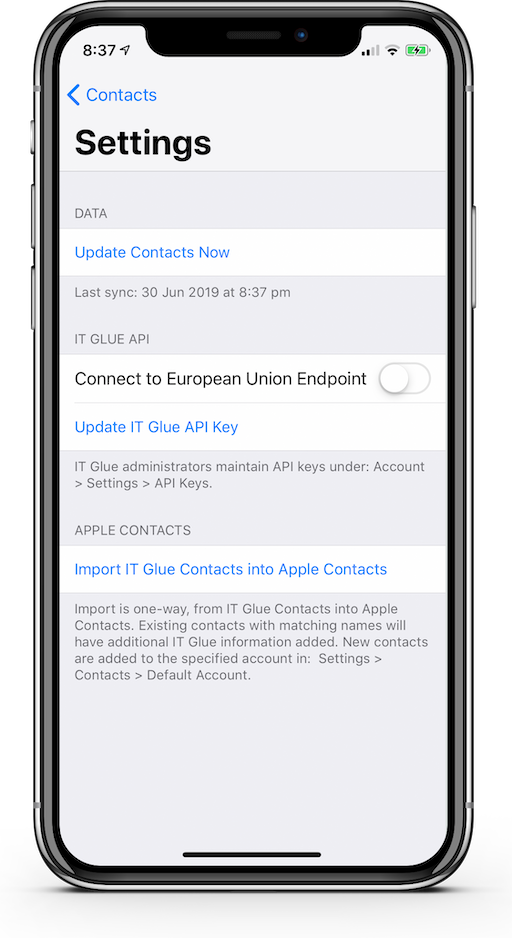

<h1 align="center">
   
  
   
  IT Glue Contacts
   
</h1>
<h3 align="center">IT Glue Contacts saves time by streamlining access to client contact details.</h3>

The IT Glue Contacts iPhone app retrieves contacts from IT Glue, collates them with additional organization information and presents the data in the form of an intuitive Apple Contacts design for ease of use.

Prior to this app, looking up contact information had to be done through the IT Glue website or iPhone app and involved navigating through many search results to find the desired contact details.

In order to have immediate access to contact details in the Apple Contacts app, contact information needed to be entered manually as it cannot be directly imported from the IT Glue iPhone app into Apple Contacts. As client details are updated in IT Glue, the static information added to Apple Contacts would become out-of-date and be missing information. The IT Glue Contacts app eliminates the tedious task of keeping Apple Contacts up-to-date and removes the need to manually create individual contact entries.

## Demo
<h3 align="center">
	Searching For & Viewing Contacts 
	
	 
</h3>

## Key Features

* 100% modern Swift code with no third-party dependencies (no external code)
* Designed to look and feel like Apple’s Contacts app
  - Easy to use search
  - Tap to directly message, call and email contacts
  - Tap postal addresses to get directions
  - Link to directly access a contact on the IT Glue website
  - Ability to import individual contacts into Apple Contacts as well as share them via iMessage, AirDrop, and email
  - Supports IT Glue phone numbers with extensions
* Ability to bulk import all IT Glue contacts into Apple contacts 
  - Adds additional information to existing contacts
  - Importing into Apple contacts allows incoming calls and messages to be identified
* Generates contact entries for organization locations, with a location's phone number, address and notes
* Employees assigned a location in IT Glue have that location as their work address in IT Glue Contacts 
* Changes made in IT Glue are updated in IT Glue Contacts
  - App data is read-only and does not modify data in IT Glue
* Allows staff to keep personal contacts and business IT Glue contacts separate
  - Bulk contacts imported into Apple Contacts are added to an "IT Glue" group, that can be hidden
* European IT Glue users are able to use the EU IT Glue API endpoint
* The IT Glue API key is stored in the Keychain

## Installation

1. Download the project and open it in [Xcode](https://apps.apple.com/us/app/id497799835). The app target can be set to the simulator or [a real iPhone](https://www.twilio.com/blog/2018/07/how-to-test-your-ios-application-on-a-real-device.html). Tip: Once the app has been installed on a real iPhone it will continue to work untethered.

2. The first time IT Glue Contacts is opened a valid IT Glue API key is requested. The keyboard has been intentionally disabled on this screen as the API key should be pasted in, not typed. If you are using the simulator, copy the API key to your Mac's clipboard > select the simulator > Edit > Send Pasteboard > tap the white field under Step 3 and paste. On a real iPhone the [Universal Clipboard](https://support.apple.com/kb/ph25168?locale=en_US) is the easiest way to share your Mac's clipboard with your iPhone. Alternatively the API key can be transfered in a note or via another app. 
 

3. Tapping Settings in the app displays the following; the timestamp of the most recent sync, the option for European users to use the EU IT Glue endpoint, update the IT Glue API key in use and import all IT Glue contacts into Apple Contacts. 
 

