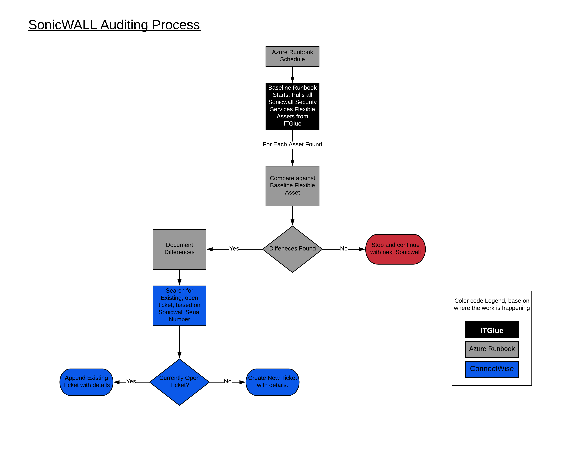
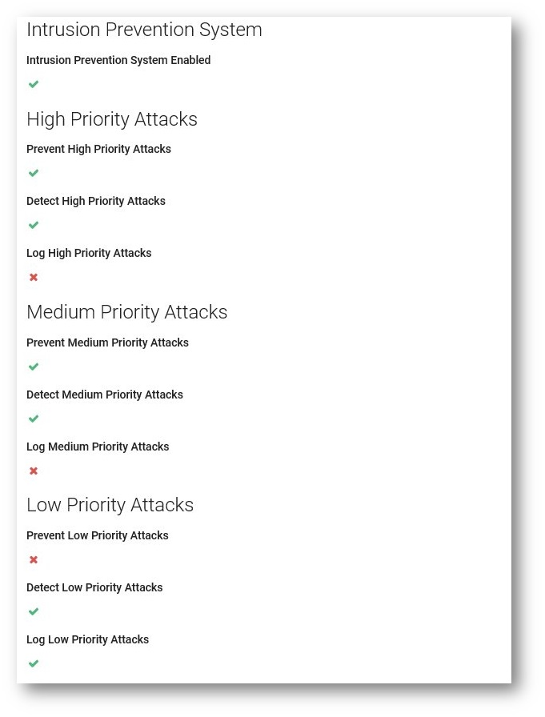

# SonicWALL Firewall Security Services Auditing

This project involves making Flexible Assets for SonicWall Security Services in ITGlue to allow easy auditing and ticketing of security services, without the use of SonicWALL's GMS. For example, if a client's SonicWall Gateway AV is turned off while troubleshooting an issue, when these scripts run, a ticket will be created that indicates Gateway AV is off and needs to be re-enabled. We are also documenting all Address Objects on the SonicWall.

### Prerequisites

Hardware:
    Next Gen SonicWALLs that support the SonicOS 6.5.3 firmware. (Required for SonicOS API introduced in version 6.5.1. We are NOT using SSH)

Software/Services:

Azure Automation Account or Server to Run Scripts with Powershell version 3 or above.

Database (Can be SQL, Power Apps Common Data Service, Excel SpreedSheet/CSV or even ITGlue) of client external IP address, and their ITGlue ID.

Azure KeyVault (Used to store ITGlue and Ticketing Software API keys)

Enable the SonicOS API for each SonicWALL using Basic Auth

ITGlue:

SonicWALL admin passwords documented and specific password Category set for them. (Example, We used the Password Category "SonicWALL Admin")

SonicWALL Security Services and SonicWALL Address Object flexible asset types (See JSON files)

### Script Logic
Below are high level diagrams of the workflow for these scripts.

Data Collection Process and Updating to ITGlue

Auditing and Ticket Generation Process

### Security Considerations

In an effort to ensure Security is kept for our company and clients, I've chosen to use Auzre for handling the Powershell Scripts.
Using an Azure Automation account and Azure Key Vault, we are able to pull API Keys and Sonicwall Passwords without the fear of this sensitive information being passed or stored insecurely. This could be modified to run less securely on a local machine fairly easily. I would recommend running in Azure Automation and using Azure Key Vault for API key storage. Approved IPs are only allowed to connect to our SonicWalls, so the use of an Azure Hybrid worker is required to make that secure connection.

### Integration Features
A.  Documenting the following Security Services for Sonicwalls and tagging Flexible Asset to Sonicwall Config

    1.  GateWay Anti Virus
   
   
    2.  App Control Advanced
   
        a.  Encrypted Key Exchange and Tor
   
    
    3.  Intrusion Prevention
   
    
    4.  Anti-Spyware
    
   
    5.  RealTime Black List
    
    6.  BotNet Filter
   
   
    7.  Geo-IP Filter
        a. Names of the Allowed and Blocked Countries.
   
    
B.  Documenting Basic Sonicwall Information

C.  Documenting All Address Objects for Sonicwall, creating their own Flexible Asset and tagging them to SonicWall config.
   
   
   
   
   
   
   
   
   

D.  Using ConnectWise Manage API to Create Ticket for out of SOP settings.

## Author
Ramon Ayala - Entech
https://EntechUS.com
